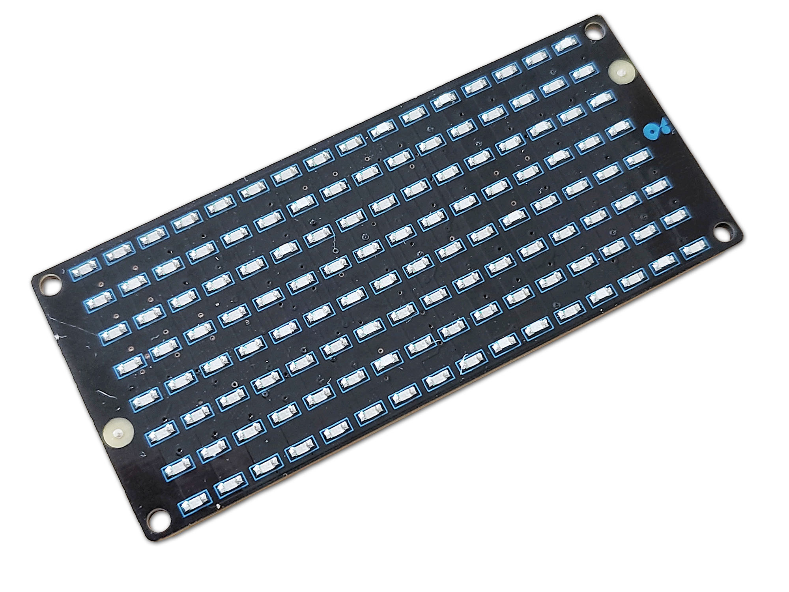
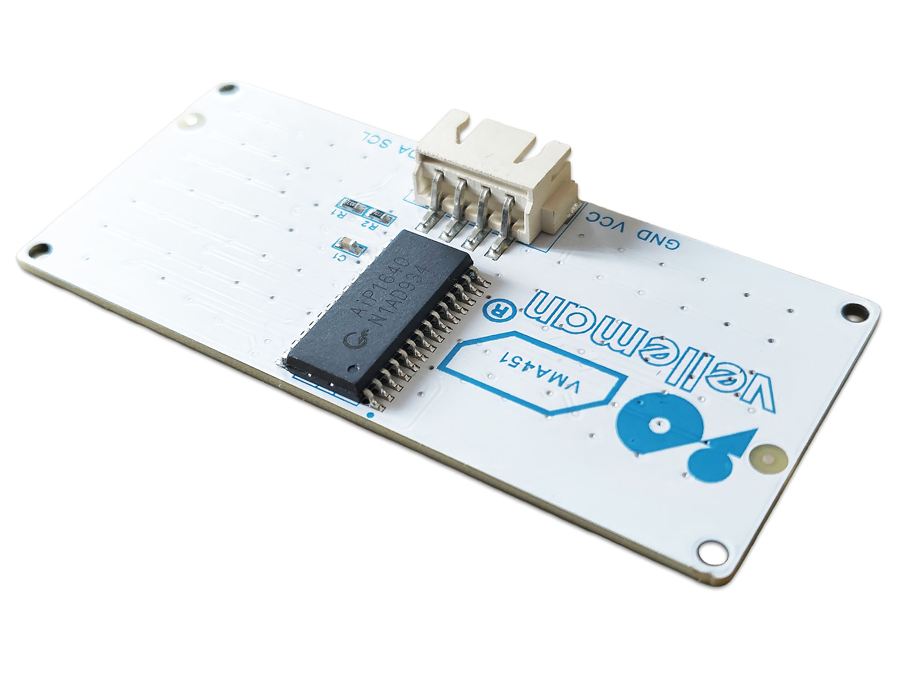
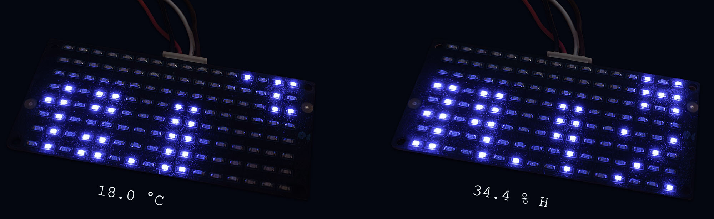

# VMA451 Library for Raspberry Pi Pico

This is a C++ library for controlling the VMA451 16x8 LED Matrix Display (based on the AiP1640 driver) using a Raspberry Pi Pico.


 

## Features

*   **16x8 LED Matrix Control**: Individually control columns or display text.
*   **Brightness Control**: Adjustable brightness levels (0-7).
*   **Text Display**: Built-in support for displaying numbers, minus sign, decimal points, and % into the 5 bottom rows of the display.
*   **Symbol Display**: Add custom symbols to the top 3 rows of the display, aligned on the right side.
*   **Display Flipping**: Software support for horizontal (mirror) and vertical (upside-down) flipping.
*   **Buffer System**: Prepare frames in a buffer before displaying them. Includes raw buffer access for custom graphics.
*   **Simple Interface**: Uses a custom 2-wire serial protocol (CLK, DIO).



## Hardware Connection

Connect the VMA451 module to the Raspberry Pi Pico:

*   **CLK**: Connect to any GPIO pin (e.g., GP14).
*   **DIO**: Connect to any GPIO pin (e.g., GP15).
*   **VCC**: 3.3V or 5V.
*   **GND**: Ground.

## Documentation

Full API documentation is available in [DOC-API.md](DOC-API.md).

## Example Usage

See `examples/basic_example.cpp` for a complete example.

```cpp
#include "pico/stdlib.h"
#include "VMA451.h"

// Define pins
#define CLK_PIN 14
#define DIO_PIN 15

int main() {
    stdio_init_all();

    // Initialize display
    VMA451 display(CLK_PIN, DIO_PIN);

    // Set brightness (0-7)
    display.set_brightness(3);

    while (true) {
        // Display a number
        display.display_numbers("12.34");
        sleep_ms(2000);
        
        // Clear
        display.clear();
        sleep_ms(500);
    }

    return 0;
}
```

## License

BSD-3-Clause
